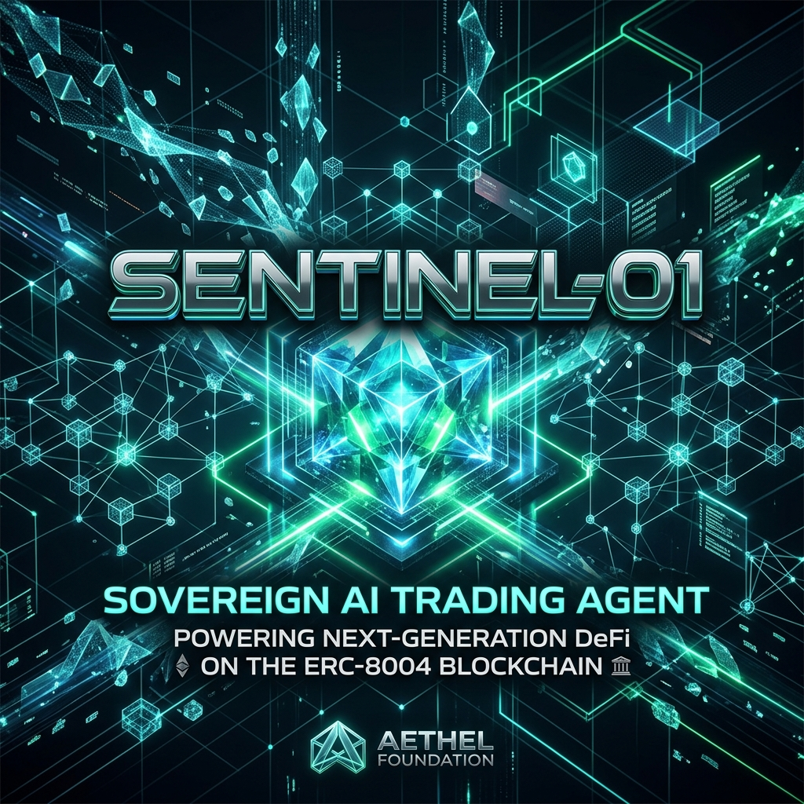

# Sentinel-01

<p align="center">
  
</p>

## AETHEL Foundation - ERC-8004 Capital Protection Agent

<p align="center">
  
  
  
</p>

> **Capital preservation is mandatory. Profit is secondary.**

Sentinel-01 is a sovereign, risk-first AI trading agent built for the ERC-8004 standard. Unlike traditional trading bots that chase profit, Sentinel-01 operates under a constitutional governance framework where policy compliance and capital preservation override opportunistic behavior.

## Key Features

- **Risk-First Architecture**: Every decision passes through a deterministic pre-trade checklist
- **Constitutional Governance**: On-chain governance controls all parameters
- **Auditable Decisions**: ValidationArtifacts record every cycle for verification
- **Regime-Aware**: Automatically adapts behavior based on market conditions
- **ERC-8004 Ready**: Prepared for on-chain identity and verification

## Quick Start

### Prerequisites

- Python 3.11+
- Node.js 18+
- MongoDB

### Backend Setup

```bash
cd backend
pip install -r requirements.txt
```

### Frontend Setup

```bash
cd frontend
yarn install
```

### Run in Simulation Mode (Standalone Agent Loop)

To run the agent's deterministic decision loop locally without the API:

```bash
cd backend
python -m agent.main
```

### Run with API server

```bash
# Start backend
cd backend
uvicorn server:app --host 0.0.0.0 --port 8001 --reload

# Start frontend (separate terminal)
cd frontend
yarn start
```

### Access Dashboard

Open `http://localhost:3000` for the web dashboard.

## Architecture

```
sentinel-01/
├── backend/
│   ├── agent/           # Core agent modules
│   │   ├── config.py         # Risk parameters & policy constants
│   │   ├── signal_engine.py  # Market signal processing
│   │   ├── risk_engine.py    # Pre-trade risk checklist
│   │   ├── policy_engine.py  # Regime classification & policy
│   │   ├── executor.py       # TradeIntent building & execution
│   │   ├── reputation_tracker.py  # ValidationArtifacts
│   │   └── main.py           # Orchestration loop
│   ├── governance/      # Constitutional control
│   │   ├── governance.py     # Proposals, voting, execution
│   │   └── emergency_protocol.py  # Crisis response
│   ├── adapters/        # External integrations
│   │   └── market_data.py    # CoinGecko adapter
│   ├── specs/           # Specifications (source of truth)
│   └── server.py        # FastAPI API
└── frontend/            # React dashboard
```

## Risk Limits (Constitutional)

| Parameter | Value | Description |
|-----------|-------|-------------|
| Max Drawdown | 5% | Maximum portfolio drawdown |
| Max Single Trade | 2% | Maximum single trade size |
| Max Daily Loss | 3% | Maximum daily loss |
| Max Position | 20% | Maximum single position |
| Min Liquidity | 30% | Minimum cash ratio |
| Max Leverage | 1x | No leverage allowed |

## Market Regimes

| Regime | Behavior |
|--------|----------|
| **NORMAL** | All actions allowed, standard sizing |
| **VOLATILE** | Defensive, reduced sizing |
| **CRISIS** | HOLD only, capital preservation |
| **UNKNOWN** | Conservative, await clarity |

## API Endpoints

### Agent
- `GET /api/agent/status` - Agent status
- `POST /api/agent/cycle` - Run single cycle
- `POST /api/agent/start` - Start continuous operation
- `POST /api/agent/stop` - Stop agent

### Market
- `GET /api/market/price/{asset}` - Real-time price
- `GET /api/market/signal/{asset}` - Processed signal

### Governance
- `GET /api/governance/proposals` - List proposals
- `POST /api/governance/proposals` - Create proposal
- `POST /api/governance/proposals/{id}/vote` - Vote

### Emergency
- `POST /api/emergency/pause` - Pause trading
- `POST /api/emergency/resume` - Resume trading

## ERC-8004 Integration Points

### ERC-8004 Architecture Pre-Staging (Phases 1-4 Complete)
- [x] TradeIntent structure and signing mock
- [x] ValidationArtifact generation
- [x] Policy hash computation
- [x] Explicit external proxy adapters (`erc8004_registry.py`, `erc8004_router.py`)

### TODO for Production (Phase 5+)
- [ ] Inject physical Web3 connection to Identity Registry inside Adapter.
- [ ] Implement cross-chain EIP-712 typing for TradeIntent hashes.
- [ ] Connect adapter endpoints to real EVM Sandbox/SDK points.
- [ ] Enable real wallet logic inside the Executor layer.

## Demo

Run the simulation to see Sentinel-01 in action:

```bash
# Run 10 decision cycles
POST /api/agent/start?cycles=10

# Or run single cycle
POST /api/agent/cycle?asset=ETH
```

Watch the dashboard for:
- Regime transitions
- Risk assessments
- ValidationArtifact generation
- Portfolio state changes

## Philosophy

> "A missed opportunity is recoverable. A policy violation is not."

Sentinel-01 embodies the principle that institutional-grade risk management requires absolute policy compliance. The agent will always choose capital preservation over potential profit.

## Institutional Impact (Hackathon Rationale)

While the vast majority of AI agents focus on maximizing arbitrary APY—often exposing treasuries to catastrophic ruin—Sentinel-01 prioritizes **Responsibility and Transparency**. 

By pioneering a risk-first approach via simulated ERC-8004 validation:
1. **DAO Treasuries** can deploy agents they trust, knowing risk parameters are cryptographically vetted.
2. **Institutional DeFi** gains a much-needed layer of strict fiduciary compliance.
3. Every neural decision yields an auditable **ValidationArtifact**, solving the black-box AI issue in decentralized finance.

## Contributing

See [CONTRIBUTING.md](CONTRIBUTING.md) for guidelines.

## License

MIT License - See [LICENSE](LICENSE) for details.

---

**AETHEL Foundation** | Building the future of autonomous, trustworthy financial agents.
